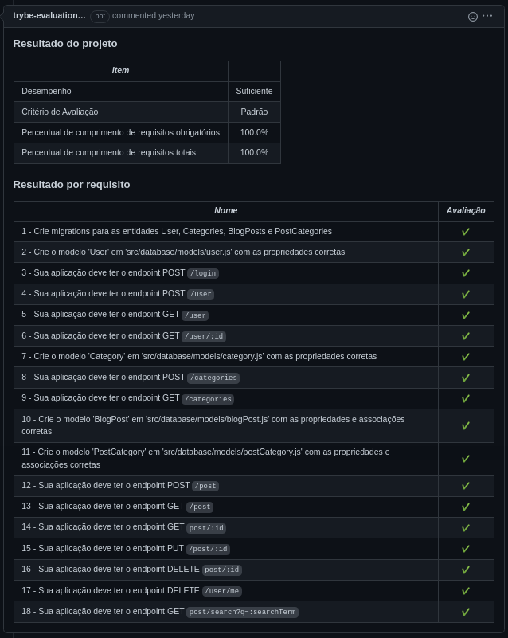

# Português 🇧🇷🇵🇹

<details>
  <summary>
    Saiba mais
  </summary>
  
  # Blogs Api
Projeto da [Trybe](https://www.betrybe.com/) - Bloco 24 - REST API para gestão de blog feita com Node.js e Sequelize.

## 💻 Projeto

API RESTful para uma aplicação de produção de conteúdo para um blog utilizando Node.js e Sequelize.

<details>
  <summary><strong>🏆 Meu desempenho</strong></summary><br />

  
</details>


## 🚀 Tecnologias
> Este projeto foi desenvolvido com:

- Node JS
- Express
- MySQL
- Docker
- Docker Compose
- Postman

## 📌 Habilidades
> Habilidades desenvolvidas:

- Desenvolver uma API RESTful de um CRUD (Create, Read, Update e Delete);
- Utilizar o ORM Sequelize para a leitura e escrita em um banco de dados SQL.


## 🐋 Executando o Docker Compose

```bash
docker-compose up -d
docker exec -it blogs_api bash
```

## ⬇️ Instalando dependências

```bash
npm install
``` 

## ⚡ Executando o projeto

- Definindo as varáveis de ambiente em um arquivo .env;
- Criando o banco de dados e as tabelas com:

```
npx sequelize db:create
npx sequelize db:migrate
```

- Se desejado, populando as tabelas com dados iniciais com:

```
npx sequelize db:seed:all
```

- Após isso, a aplicação pode ser iniciada com:

```
npm run debug
```

## Time de desenvolvimento
> Projeto individual:
  

## 💬 Contatos

<div align="center" style="display: inline_block">
  <a href="https://rabeloguedes.github.io" target="_blank">
    
  </a> 
  <a href="https://www.linkedin.com/in/al%C3%AA-emmanuel-rabelo-guedes/" target="_blank">
    
  </a> 
   <a href="mailto:rabeloguedes@proton.me">
     
  </a>
</div>

</details>

# English 🇺🇸🇬🇧

<details>
  <summary>
    More
  </summary>
  
  # Blogs Api
Project from [Trybe](https://www.betrybe.com/) - Block 24 - REST API for blog management made with Node.js and Sequelize.

## 💻 Project

API RESTful for a blog content production application using Node.js and Sequelize.

<details>
  <summary><strong>🏆 My accomplishment</strong></summary><br />

  
</details>


## 🚀 Technologies
> This project was developed with:

- Node JS
- Express
- MySQL
- Docker
- Docker Compose
- Postman

## 📌 Skills
> Practiced skills:

- Developing an API RESTful CRUD (Create, Read, Update and Delete);
- Using the ORM Sequelize for reading and writing in a SQL database.

## 🐋 Executing the Docker Compose

```bash
docker-compose up -d
docker exec -it blogs_api bash
```

 ## ⬇️ Install dependencies

```bash
npm install
``` 

## ⚡ Running the project

- Defining the environment variables in a .env file;
- Creating the database and tables with:

```
npx sequelize db:create
npx sequelize db:migrate
```

- If desired, populating the tables with initial data with:

```
npx sequelize db:seed:all
```

- After that, the application can be started with:

```
npm run debug
```

## Squad
> Single Person Project:
  

## 💬 Contact

<div align="center" style="display: inline_block">
  <a href="https://rabeloguedes.github.io" target="_blank">
    
  </a> 
  <a href="https://www.linkedin.com/in/al%C3%AA-emmanuel-rabelo-guedes/" target="_blank">
    
  </a> 
   <a href="mailto:rabeloguedes@proton.me">
     
  </a>
</div>

</details>

# Deutsch 🇩🇪

<details>
  <summary>
    Mehr
  </summary>
  
  # Blogs Api
Projekt von [Trybe](https://www.betrybe.com/) - Block 24 - REST API für Blog-Verwaltung mit Node.js und Sequelize.

## 💻 Projekt

API RESTful für eine Blog-Inhaltsproduktionsanwendung mit Node.js und Sequelize.

<details>
  <summary><strong>🏆 Meine Leistung</strong></summary><br />

  
</details>

## 🚀 Technologies
> Dieses Projekt wurde mit den entsprechenden Technologies hergestellt:

- Node JS
- Express
- MySQL
- Docker
- Docker Compose
- Postman

## 📌 Fähigkeiten
> Ausgeübte Fähigkeiten:

- Entwickeln einer API RESTful CRUD (Create, Read, Update und Delete);
- Verwenden des ORM Sequelize zum Lesen und Schreiben in einer SQL-Datenbank.

## 🐋 Ausführen des Docker Composes

```bash
docker-compose up -d
docker exec -it blogs_api bash
```

## ⬇️ Installieren dependencies

```bash
npm install
``` 

## ⚡ Projekt ausführen

- Definition der Umgebungsvariablen in einer .env-Datei;
- Erstellen der Datenbank und Tabellen mit:

```
npx sequelize db:create
npx sequelize db:migrate
```

- Wenn gewünscht, können die Tabellen mit initialen Daten gefüllt werden mit:

```
npx sequelize db:seed:all
```

- Nachdem die Anwendung gestartet werden kann mit:

```
npm run debug
```

## Entwickungsteam
> Einer Person Projekt:
  

## 💬 Kontakt

<div align="center" style="display: inline_block">
  <a href="https://rabeloguedes.github.io" target="_blank">
    
  </a> 
  <a href="https://www.linkedin.com/in/al%C3%AA-emmanuel-rabelo-guedes/" target="_blank">
    
  </a> 
   <a href="mailto:rabeloguedes@proton.me">
     
  </a>
</div>

</details>
